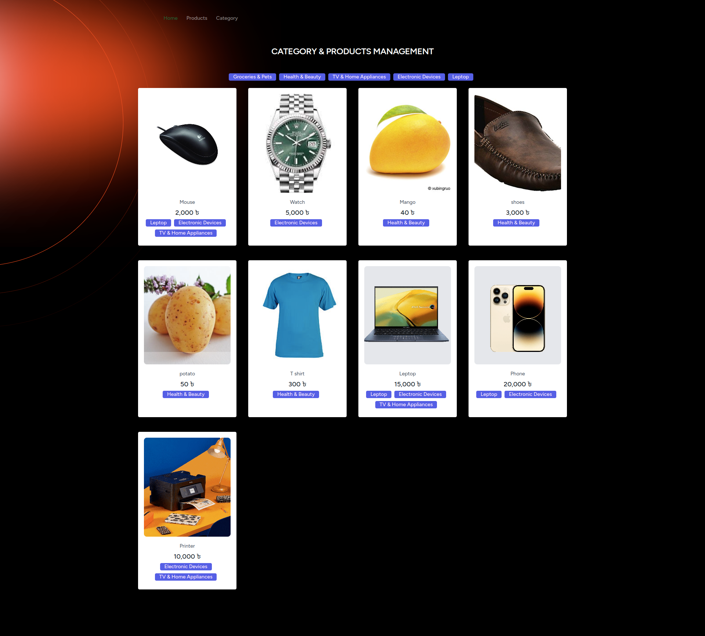
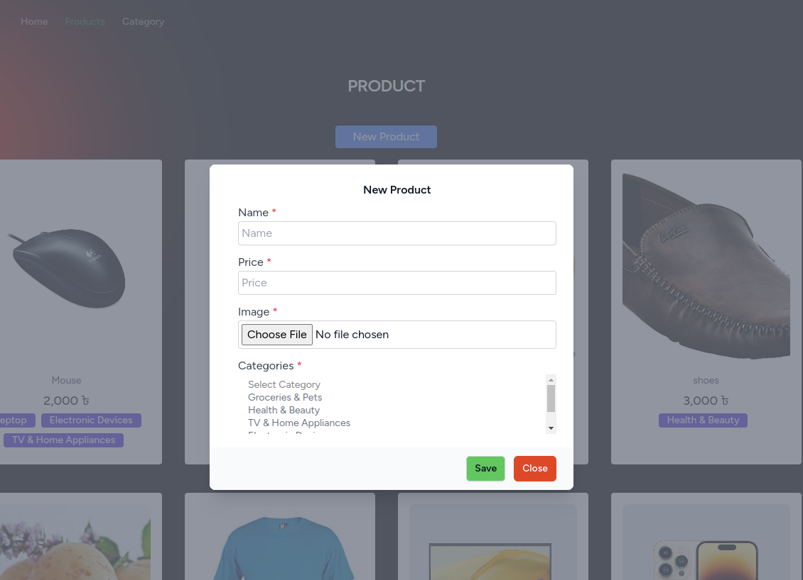
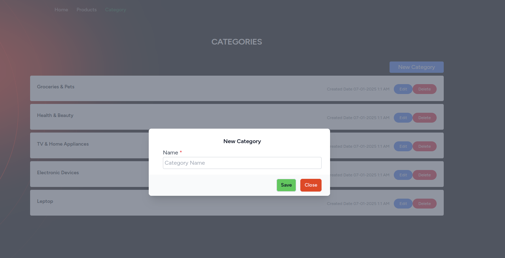
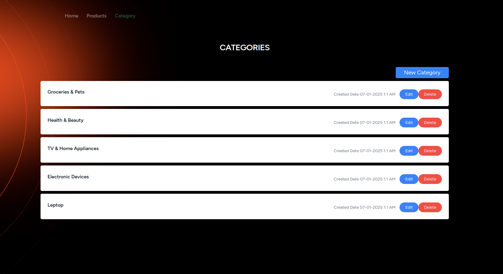

# Product & Category Management System

<a href="http://product-category-management.monisoft.xyz" target="_blank">🚀 Project Live on</a>

## 📌 About Project

This project is a **Product and Category Management System** that includes **API creation, server-side validation, error handling, and database management** with a **many-to-many relationship**. It follows best practices for **API development, image uploading, exception handling**, and **modern UI design** using **Vue.js and Tailwind CSS**.

---

## 🚀 Features

### 🔹 API Development

-   RESTful API for managing **Products** and **Categories**
-   CRUD operations with authentication and authorization
-   JSON responses with proper status codes

### 🔹 Server-Side Validation & Error Handling

-   **Backend Validation**: Laravel's validation rules for data integrity
-   **Frontend Validation**: Prevent incorrect data submission
-   **Database Constraints**: Unique fields, required fields, and constraints
-   **Exception Handling**: Custom global error handling for APIs

### 🔹 Database Model Relations

-   **Many-to-Many** relationship between **Products** and **Categories**
-   Pivot tables for managing product-category assignments
-   Optimized queries using **Eloquent ORM**

### 🔹 Category Management

-   **Create Form**: Add new categories
-   **Fields**: Category name
-   **Validation**: Frontend and backend validation
-   **Save to Database**: Store category details securely

### 🔹 Product Management

-   **Product Form**: Add new products
-   **Fields**: Name, Price, Image, and **Category Multi-Selection**
-   **Validation**: Form validation for all fields
-   **Save to Database**: Store product details
-   **Edit & Delete Options**: Manage products easily

### 🔹 Image Uploading

-   Secure image upload for products
-   File validation (size, format) and optimized storage

### 🔹 Best API Exception Handling

-   Centralized error handling with meaningful messages
-   Custom API responses for debugging
-   Handling HTTP errors gracefully (404, 422, 500)

### 🎨 UI Design

-   **Frontend Built With Vue.js & Tailwind CSS**
-   Responsive and modern design
-   Smooth user experience with real-time validation

---

## 🛠️ Tech Stack

| Technology       | Version |
| ---------------- | ------- |
| **Ubuntu**       | 20.04   |
| **PHP**          | 8.2     |
| **Laravel**      | 11      |
| **Node.js**      | 22      |
| **MySQL**        | Latest  |
| **Vue.js**       | 3.x     |
| **Tailwind CSS** | Latest  |

---

## ⚡ Installation Guide

### 1️⃣ Clone the Repository

```sh
git clone git@github.com:Monirujjaman27/product-category-management.git
cd product-category-management
```

```sh
composer update && php artisan serve
```

```sh
npm run install && npm run dev
```





